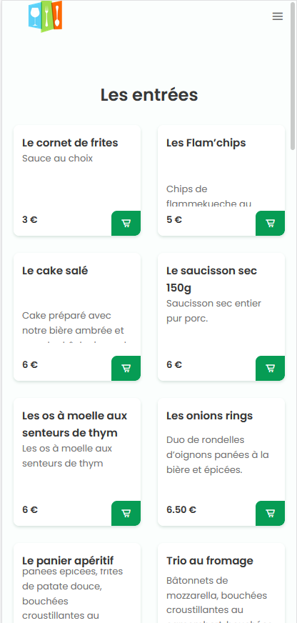

<div id="top"></div>
<!-- PROJECT LOGO -->
<br />
<div align="center">
  <a href="https://gitlab.com/ModernMenu/dashboard">
    
  </a>

  <h3 align="center">Menu de restaurant responsive</h3>

  <p align="center">
    Menu accessible via le scan d'un Qrcode
    <br />
    <br />
    <a href="https://menu.novation.menu/">
    
  </a>
  <br />
    <a href="https://menu.novation.menu/">Voir la démo</a>

  </p>
</div>


<!-- TABLE OF CONTENTS -->
<details>
  <summary>Table des matières</summary>
  <ol>
    <li>
      <a href="#a-propos-du-projet">A propos du projet</a>
      <ul>
        <li><a href="#créé-avec">Créé avec</a></li>
      </ul>
    </li>
    <li><a href="#usage">Usage</a></li>
    <li><a href="#roadmap">Roadmap</a></li>
    <li><a href="#contact">Contact</a></li>
    <li><a href="#crédits">Crédits</a></li>
  </ol>
</details>


<!-- ABOUT THE PROJECT -->
## A propos du projet



Quand le client scanne le QRcode mise à disposition par le restaurateur. Il accède à ce menu depuis lequel il a la possibilité de commander son repas...

<p align="right">(<a href="#top">back to top</a>)</p>


### Créé avec

Cette section liste les technologies utilisées dans le cadre de ce projet

* HTML\CSS
* jquery\marquee pour le scrolling de texte

<p align="right">(<a href="#top">back to top</a>)</p>


<!-- USAGE EXAMPLES -->
## Usage

Voici un bref descriptif du mode de fonctionnement de ce projet

Le client parcourt les différentes rubriques, fait son choix en ajoutant les produits dans le panier et valide sa commande. La commande apparait dans le tableau de bord du retaurateur qui peut traiter la commande dans les plus brefs délais.

<p align="right">(<a href="#top">back to top</a>)</p>


<!-- ROADMAP -->
## Roadmap

- [x] Création de la maquette du menu
- [x] Créer des templates Flask à partir de la maquette
- [ ] ...

<p align="right">(<a href="#top">back to top</a>)</p>


## Pré-requis

Ce projet fait partie intégrante du projet: https://gitlab.com/ModernMenu/dashboard, il est indispensable que ce dernier soit opérationnel.
## Installation

Pour installer le projet:

```bash
git clone https://gitlab.com/ModernMenu/menu.git
```
On se rend dans le dossier généré et on crée un environnement virtuel:

```python
python -m venv venv
```

On l'active:

```python
.\venv\Scripts\activate
```

On installe les packages nécessaires:

```python
pip install -r .\requirements.txt
```
Pour lancer le programme:

```bash
python .\app.py 
```

<p align="right">(<a href="#top">back to top</a>)</p>
<!-- CONTACT -->
## Contact

Nagi KARAOUZENE - nagi.karaouzene@outlook.com
Boualem BEKTHAOUI - bbekhtaoui2021@gmail.com
Richard CRUZ - richard.m2iformation@gmail.com

Project Link: [https://gitlab.com/ModernMenu/menu](https://gitlab.com/ModernMenu/menu)

<p align="right">(<a href="#top">back to top</a>)</p>


<!-- ACKNOWLEDGMENTS -->
## Crédits

* [Responsive Website Restaurant (Bedimcode)](https://github.com/bedimcode/responsive-website-restaurant)

<p align="right">(<a href="#top">back to top</a>)</p>


